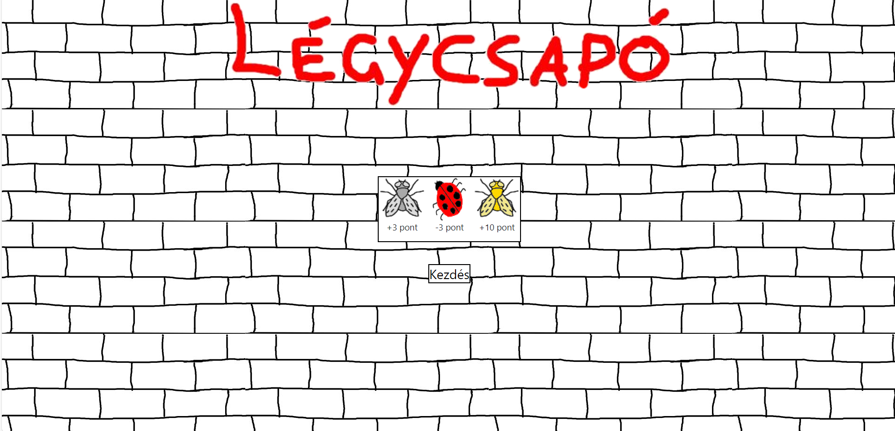
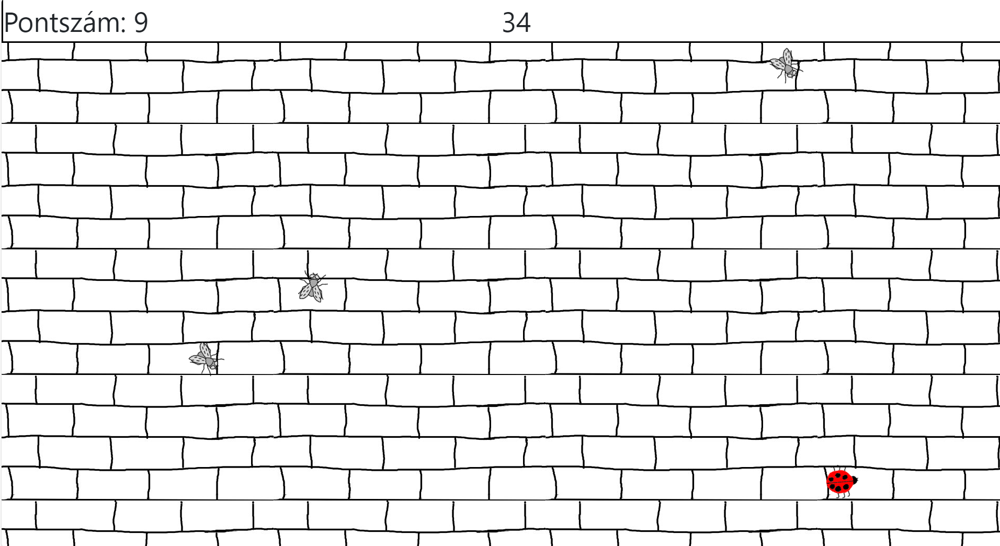
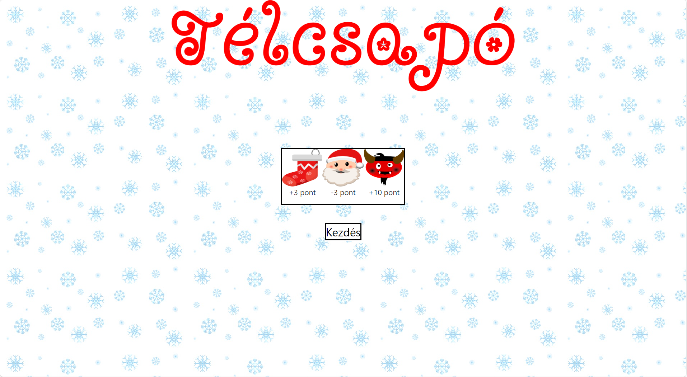
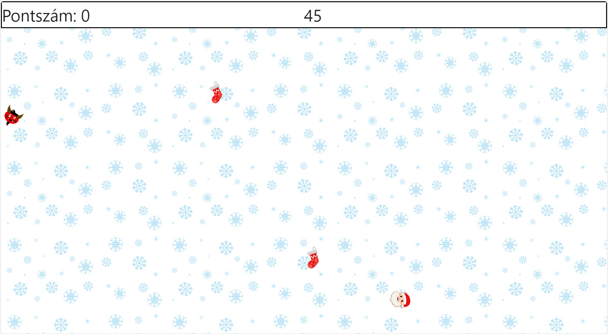

# FlySwatter

An in-brower fly-swuatter game in which random targets show up.
If you can hit them, you gain or lose points.

The goal is to collect as many points as you can in the limited time frame.

A standard target is worth 3 points.
An extra target is worth 10 points.
If you hit the target that you should avoid, you lose 3 points.

## Summer edition

- Standard target: grey fly
- Extra target: golden fly
- Target to avoid: ladybug

### Index page

### Game

## Winter edition

- Standard target: a stocking
- Extra target: Krampus
- Target to avoid: Santa

### Specifics of this edition

If you hit Santa (who you should avoid), a dizzy Santa shows up.

If you hit the extra target, the Krampus, it will turn into an elf.

### Index page 

### Game

## Switch between Winter and Summer mode

Change the value of AppSettings.Edition in appsettings.json to either "summer" or "winter"